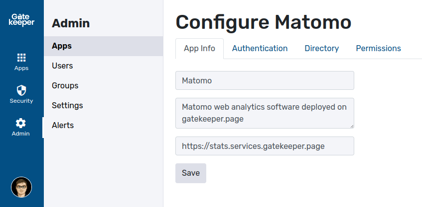

# Editing applications

You can edit any created application by pressing "Edit" in the "Apps" admin panel. This interface will allow you to:

* Change the name and description of apps.
* Change the authentication settings.
* Change the directory settings.
* Add or remove groups to the group.


**Note:** Currently, it is not possible to change the application type after it has been setup.


