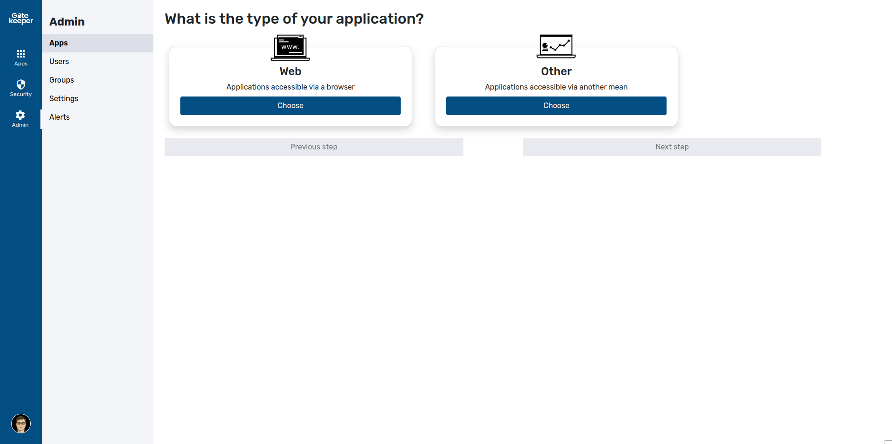

# Creating applications

Gatekeeper includes an intuitive wizard for setting up applications. To start it, go to the admin panel and select "Add new app".

The wizard will start by asking you a few initial questions about the application. Once it has determined the application's type, it will show the available authentication and directory modes.

To learn more about the different settings, please read our documentation page about it:



